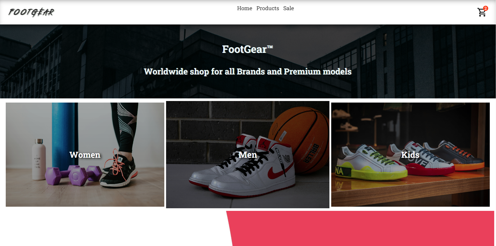
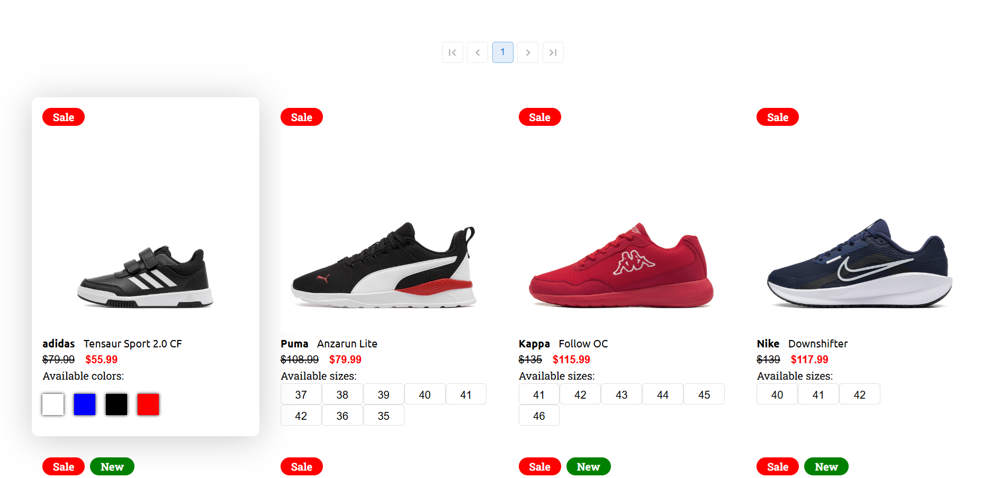
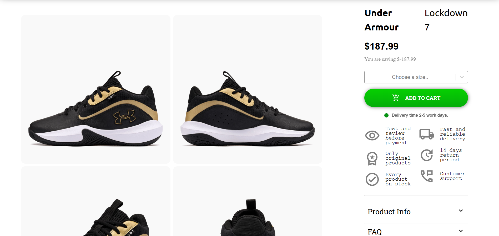

# FootGear - E-commerce Web App for Shoes





FootGear is a modern e-commerce platform specializing in footwear, offering users a seamless shopping experience for the latest shoe trends and styles.

## Admin Account

```
account: admin@abv.bg
password: admin123321
```
This site was built to production using [Vercel](https://vercel.com/).

Live Demo - [FootGear](https://blessed-clothing-ggs9.vercel.app/).

## Features

- 🛍️ **Product Catalog**: Browse through a wide range of shoes with detailed product pages
- 🔍 **Advanced Search**: Find products by category, age, size, collection
- 🛒 **Shopping Cart**: Add, remove, and manage items in your cart
- 💳 **Secure Checkout**: Multiple payment options with secure transactions
- 📱 **Responsive Design**: Optimized for all devices
- 🔐 **User Authentication**: Secure login and registration system
- ⛑️ **Admin Panel**: Create new products using the admin panel

## Technologies Used

### Frontend
- React.js
- HTML5 & CSS3
- Redux
- ContextAPI
- MUI Icons

### Backend
- Node.js
- Express.js
- MongoDB

### Payment Integration
- Stripe API not implemented yet

### Other Tools
- Git/GitHub
- Vite

## Installation Client

1. Clone the repository:
   ```bash
   git clone https://github.com/superGemHere/blessed-clothing.git
   ```
2. Navigate to the client directory:
   ```bash
   cd client
   ```
3. Install dependencies:
   ```bash
   npm install
   ```
4. Set up environment variables, for development server:
   ```
   VITE_LOCAL_FRONTEND_URL= http://localhost:5173/

   VITE_LOCAL_BACKEND_URL= http://localhost:3030/
   ```
5. Start the development server:
   ```bash
   npm run dev
   ```
## Installation Server

1. Clone the repository:
   ```bash
   git clone https://github.com/superGemHere/blessed-clothing.git
   ```
2. Navigate to the client directory:
   ```bash
   cd server
   ```
3. Install dependencies:
   ```bash
   npm install
   ```
4. Set up environment variables, you have to add values to some:
   ```bash
   SECRET_KEY=(YourValueHere)

   MONGO_DB_URL=(YourValueHere)

   appName=FootGear

   MONGO_DB_LOCAL_URL=mongodb://localhost:27017
   
   REFRESH_SECRET_KEY=(YourValueHere)

   CLIENT_URL=https://blessed-clothing-ggs9.vercel.app/

   LOCAL_CLIENT_URL=http://localhost:5173

   LOCAL_SERVER_PORT=3030 
   ```
5. Start the development server:
   ```bash
   npm start
   ```


## API Endpoints

### User Registration
**POST** `/api/users/register`

**Request Body:**
```json
{
  "email": "john@example.com",
  "password": "securePassword123",
  "repeatPassword": "securePassword123"
}
```

**Required Fields:**
- `email`: String, valid email address
- `password`: String, minimum 6 characters
- `repeatPassword`: "must match password"

**Response:**
```json
{
  "_id": "64c9a1b2e4b0a1a2b3c4d5e6",
  "name": "John Doe",
  "email": "john@example.com",
  "token": "eyJhbGciOiJIUzI1NiIsInR5cCI6IkpXVCJ9..."
}
```

### Error Responses
If email is missing:
```json
{
  "error": "Path `email` is required"
}
```

If password is missing:
```json
{
  "error": "Path `password` is required"
}
```

